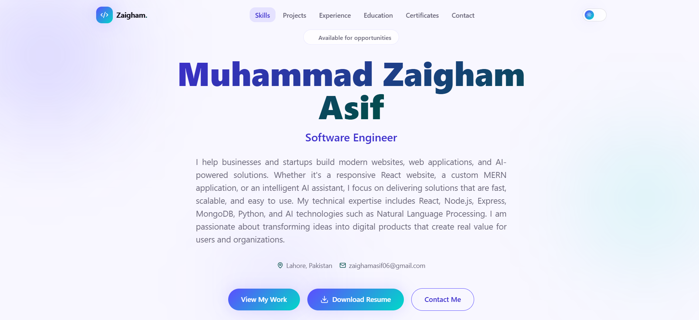

<div align="center">

# 🌐 Muhammad Zaigham Asif — Developer Portfolio

A modern, responsive, and high-performance portfolio website built to showcase my projects, technical skills, certifications, and professional journey.

<p align="center">
<a href="https://muhammadzaighamasif.vercel.app/"><strong>Live Demo</strong></a> •
</p>
</div>

---

# 📖 About

Welcome to my personal developer portfolio!

This portfolio highlights my software engineering journey, featured projects, technical expertise, certifications, and ways to connect with me. It is designed with performance, responsiveness, and modern UI/UX principles in mind.

---

# 📸 Preview

> Replace the image below with your portfolio screenshot.

<p align="center">

</p>

---

# ✨ Features

- 🎨 Modern & Clean UI
- 📱 Fully Responsive Design
- ⚡ Fast Performance with Vite
- 💻 Project Showcase
- 👨‍💻 Skills Section
- 🎓 Education & Certifications
- 💼 Experience Timeline
- 📬 Contact Section
- 🌙 Dark Mode Support 
- 🚀 SEO Friendly

---

# 🛠 Tech Stack

### Frontend

- React
- TypeScript
- Vite
- Tailwind CSS

### Languages

- HTML5
- CSS3
- JavaScript (ES6+)
- TypeScript

### Tools

- Git
- GitHub
- VS Code
- npm

### Deployment

- Vercel

---
---

# 🚀 Installation

## Clone the repository

```bash
git clone https://github.com/MuhammadZaighamAsif/Portfolio.git
```

## Navigate to the project

```bash
cd Portfolio
```

## Install dependencies

```bash
npm install
```

## Start development server

```bash
npm run dev
```

## Build for production

```bash
npm run build
```

## Preview production build

```bash
npm run preview
```

---

# 💻 Available Scripts

| Command | Description |
|----------|-------------|
| `npm run dev` | Starts development server |
| `npm run build` | Builds production version |
| `npm run preview` | Preview production build |
| `npm run lint` | Runs ESLint |

---

# 🚀 Performance Goals

- Fast Loading
- Responsive Layout
- Clean Code
- Optimized Assets
- Reusable Components
- Accessibility Friendly

---

# 🤝 Contributing

Contributions, suggestions, and improvements are always welcome.

1. Fork the repository.
2. Create your feature branch.

```bash
git checkout -b feature/new-feature
```

3. Commit your changes.

```bash
git commit -m "Add new feature"
```

4. Push to your branch.

```bash
git push origin feature/new-feature
```

5. Open a Pull Request.

---

# 📬 Contact

## Muhammad Zaigham Asif

📧 Email: **zaighamasif06@gmail.com**

💼 LinkedIn:
https://linkedin.com/in/zaigham-asif-5a5499240

🐙 GitHub:
https://github.com/MuhammadZaighamAsif

🌐 Portfolio:
https://muhammadzaighamasif.vercel.app/
---

# ⭐ Support

If you found this project useful, please consider giving it a ⭐ on GitHub. Your support is greatly appreciated!

---

# 📄 License

This project is licensed under the MIT License.

---

<div align="center">

### Thank you for visiting!

⭐ **If you like this project, don't forget to leave a star!**

</div>
