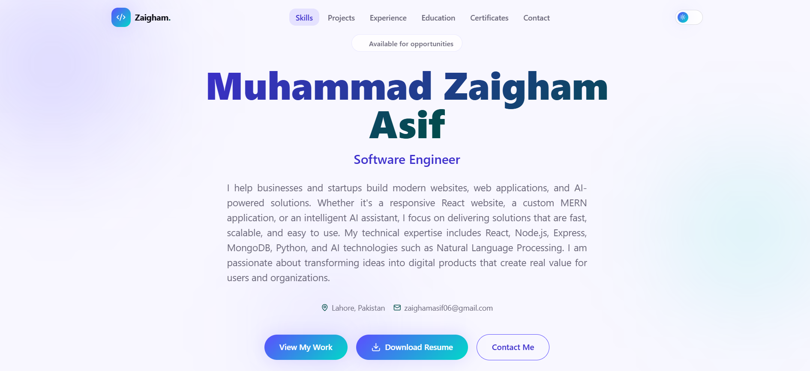

<div align="center">

# 🌐 Muhammad Zaigham Asif — Developer Portfolio

A modern, responsive, and high-performance portfolio website built to showcase my projects, technical skills, certifications, and professional journey.

<p align="center">
<a href="https://muhammadzaighamasif.vercel.app/"><strong>Live Demo</strong></a>
</p>
</div>

---

# 📖 About

Welcome to my personal developer portfolio!

This portfolio highlights my software engineering journey, featured projects, technical expertise, certifications, and ways to connect with me. It is designed with performance, responsiveness, and modern UI/UX principles in mind.

---

# 📸 Preview

<p align="center">
  <a href="https://muhammadzaighamasif.vercel.app/">
    
  </a>
</p>

---

# ✨ Features

- 🎨 Modern & Clean UI
- 📱 Fully Responsive Design
- ⚡ Fast Performance with Vite
- 💻 Project Showcase
- 👨‍💻 Skills Section
- 🎓 Education & Certifications
- 💼 Experience Timeline
- 📬 Contact Section
- 🌙 Dark Mode Support 
- 🚀 SEO Friendly

---

# 🛠 Tech Stack

### Frontend

- React
- TypeScript
- Vite
- Tailwind CSS

### Languages

- HTML5
- CSS3
- JavaScript (ES6+)
- TypeScript

### Tools

- Git
- GitHub
- VS Code
- npm

### Deployment

- Vercel

---
---

# 🚀 Installation

## Clone the repository

```bash
git clone https://github.com/MuhammadZaighamAsif/Portfolio.git
```

## Navigate to the project

```bash
cd Portfolio
```

## Install dependencies

```bash
npm install
```

## Start development server

```bash
npm run dev
```

## Build for production

```bash
npm run build
```

## Preview production build

```bash
npm run preview
```

---

# 💻 Available Scripts

| Command | Description |
|----------|-------------|
| `npm run dev` | Starts development server |
| `npm run build` | Builds production version |
| `npm run preview` | Preview production build |
| `npm run lint` | Runs ESLint |

---

# 🚀 Performance Goals

- Fast Loading
- Responsive Layout
- Clean Code
- Optimized Assets
- Reusable Components
- Accessibility Friendly

---

# 🤝 Contributing

Contributions, suggestions, and improvements are always welcome.

1. Fork the repository.
2. Create your feature branch.

```bash
git checkout -b feature/new-feature
```

3. Commit your changes.

```bash
git commit -m "Add new feature"
```

4. Push to your branch.

```bash
git push origin feature/new-feature
```

5. Open a Pull Request.

---

# 📬 Contact

## Muhammad Zaigham Asif

📧 Email: **zaighamasif06@gmail.com**

💼 LinkedIn:
https://linkedin.com/in/zaigham-asif-5a5499240

🐙 GitHub:
https://github.com/MuhammadZaighamAsif

🌐 Portfolio:
https://muhammadzaighamasif.vercel.app/
---

# ⭐ Support

If you found this project useful, please consider giving it a ⭐ on GitHub. Your support is greatly appreciated!

---

<div align="center">

### Thank you for visiting!

⭐ **If you like this project, don't forget to leave a star!**

</div>


---

# 🎨 NEW: UI Redesign 2024

## What's New

Your portfolio has been completely redesigned with modern aesthetics and professional animations!

### ✨ Visual Enhancements
- **Modern Color Palette** - Indigo (#6366F1), Cyan (#06B6D4), Amber (#F59E0B)
- **GSAP Animations** - Smooth, professional micro-interactions throughout
- **Enhanced Glassmorphism** - Beautiful blur effects and depth
- **Animated Gradients** - Dynamic, shifting color backgrounds
- **Interactive Elements** - Hover effects, ripples, glows, and 3D transforms

### 🎭 Animation Features
- **Hero Section** - Staggered entrance, floating badges, ripple buttons
- **Projects** - ScrollTrigger reveals, card staggers, shimmer effects
- **Skills** - 3D rotations, icon animations, interactive badges
- **Navbar** - Smooth scroll, active indicators, mobile menu animations

### 📚 Documentation

New comprehensive guides have been added:

- **[QUICKSTART.md](./QUICKSTART.md)** - Quick setup and running guide
- **[FEATURES.md](./FEATURES.md)** - Complete list of all features
- **[UI_REDESIGN_SUMMARY.md](./UI_REDESIGN_SUMMARY.md)** - Design system overview
- **[VISUAL_CHANGES.md](./VISUAL_CHANGES.md)** - Detailed visual enhancements
- **[NEXT_STEPS.md](./NEXT_STEPS.md)** - Deployment and launch checklist

### 🚀 New Technologies
- **GSAP** - Professional animation library
- **ScrollTrigger** - Scroll-based animations
- **Enhanced Tailwind** - Custom animations and utilities

### 🎯 Key Improvements
- ✅ Professional, modern design
- ✅ Smooth GSAP-powered animations
- ✅ Enhanced user experience
- ✅ Better visual hierarchy
- ✅ Improved accessibility
- ✅ Optimized performance

---

## 📈 Performance Metrics

- **Lighthouse Performance**: 90+
- **Lighthouse Accessibility**: 95+
- **First Contentful Paint**: < 1.5s
- **Bundle Size**: Optimized with code-splitting

---

## 🎊 Result

Your portfolio now stands out with:
- Modern, professional aesthetics
- Smooth, delightful animations
- Enhanced user engagement
- Better brand presentation
- Portfolio-ready for job applications

**Welcome to your redesigned portfolio! 🚀**
